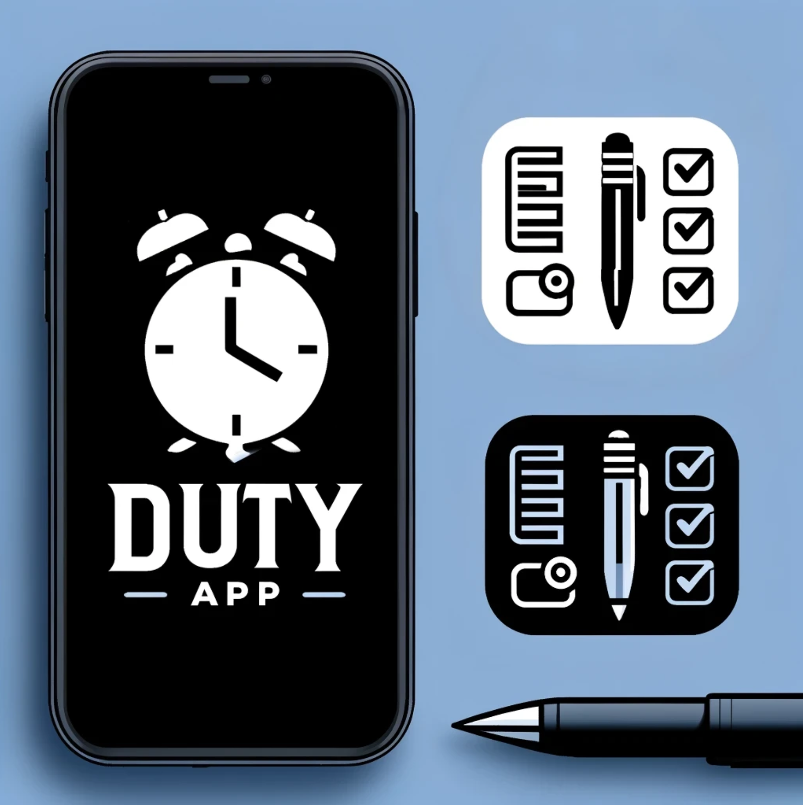

# Duty-App v1.0.0

<div style="max-width: 600px; margin: 0 auto;">
 <p align="center"> 
 
</p>

## Your Task Management Sidekick

### Stay on top of your to-do lists with DutyApp, a streamlined productivity tool. Whether you're managing personal errands, work projects, or anything in between, DutyApp empowers you to conquer your tasks with ease.

DutyApp is a full stack application that is built with the node.js runtime, typescript as a programming language, PostgreSQL with a database engine and React.js to create a friendly frontend.

This application implements clean code practices, design patterns such as dependency injection as a main approach and repository pattern for the
connection to the database.

The purpose of this application is to develop task creation, update and deletion operations, to implement code best practices
when using it.

# Features:

**Effortless Task Organization:** Seamlessly add, view, update, and delete to-do items to keep yourself on track.

**Prioritization at a Glance:** Quickly identify your most important tasks.

**Focused Productivity:**  Stay on target and avoid distractions with a clean, focused interface.

# Requirements to run it locally:

* [NodeJS](https://nodejs.org/en/download "NodeJS")
* [Typescript](https://www.npmjs.com/package/typescript)
* [React](https://es.react.dev/)
* [PostgreSQL](https://www.postgresql.org/)


# Installation instructions:

Note: 

To use this application it is necessary to read the documentation that explains the flow with which you can recreate the operations.
Using this application requires creating a database, granting privileges to a user to be able to insert data and run on 3 different ports 
both the database, the backend and finally the frontend who will be the client that consumes it.

## Check at the code documentation here to see the whole setup:

<p>
  <a href="https://docs.google.com/document/d/1oLl_-k4tW4f6_ajgXyCJtbthLUwrOrcRtbEy-rlxa8s" target="_blank">
   Link to code documentation
  </a>
</p>

## Step 1:

## Download the repo that contains both apps.

 Note: Make sure you have PostgreSQL on your PC.

## Step 2:

## Go to `/dutyApp/backend` or  `/dutyApp/frontend` and  install all packages through npm.

```sh
npm install
```

## Step 3:

## In case you want to see the logs with nodemon run the development server to watch logs in the console

```sh
npm run dev
```

OR

## Run production ready code that will build through tsc the latest version of the code that  is parsed from ts to js.

Note: the dist folder is the one that should be drop in a cloud host provider.

```sh
npm run start
```

## To test the solution:

## Run CRUD tests:

Note: Tests are only avaliable for the backend at the moment. For practicy the frotend would be tested and documented with screenshots
that will be avalible in the docs.

```sh
npm run test
```

